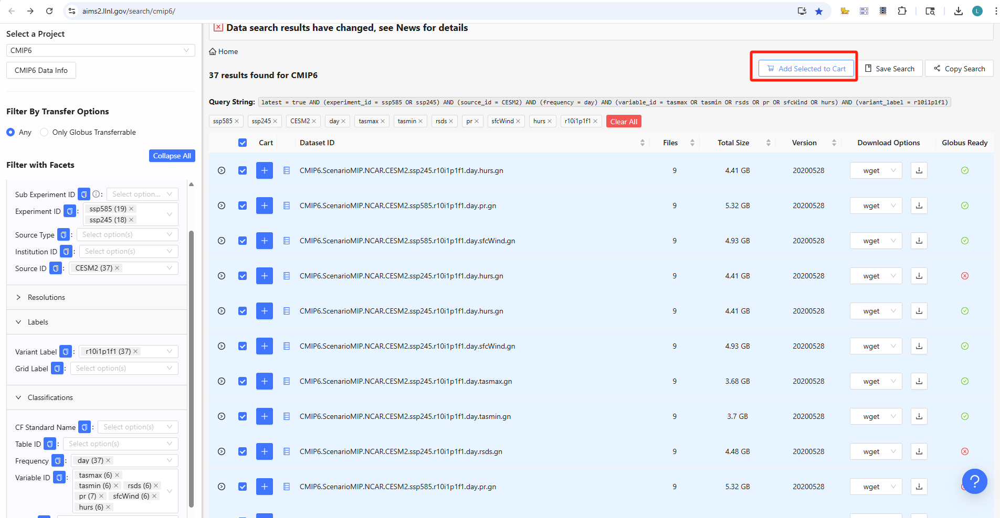
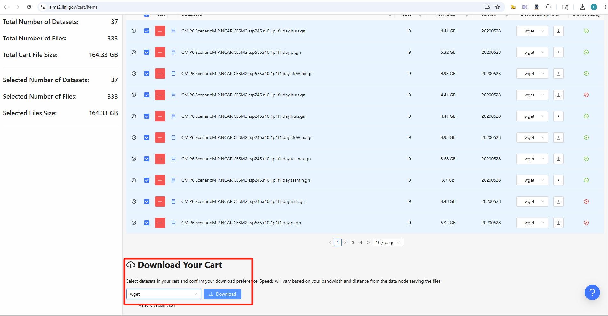

# Instructions to Download CMIP6 Data

This project enables downloading CMIP data and converting it into climate input files for the ECOSYS, Agro-IBIS, and Daycent models. Before running the script, please follow the steps below to download the required CMIP6 data first.

## Steps:

1. **Identify the data of interest**:  
   Determine which **Experiment ID** and **Source ID** you need to work with.

2. **Search for data**:  
   Visit the [CMIP6 data search website](https://aims2.llnl.gov/search/cmip6/).  
   From the left panel, select the following filters:
   - **Experiment ID**
   - **Source ID**
   - **Variant Label**
   - **Frequency**
   - **Variable ID**

3. **Add to Cart**:  
   Select all the results returned by the search and click the **"Add Selected to Cart"** button at the top of the page.  
   Example screenshot:  
   

4. **Download the script**:  
   Scroll to the bottom of the page and click the **"Download"** button in the **"Download Your Cart"** section.  
   Example screenshot:  
   

5. **Locate the script**:  
   The downloaded file will be named something like: (`wget_script_2025-7-1_17-7-22.sh`)

6. **Create a directory**:  
In your current working directory, create a new folder named: "downloaded_CMIP_data". It is used to place the downloaded CMIP data.

7. **Run the script**:  
Move the downloaded file (e.g., `wget_script_2025-7-1_17-7-22.sh`) into the `downloaded_CMIP_data` directory, then run the script:
```bash
cd downloaded_CMIP_data
sh wget_script_2025-7-1_17-7-22.sh
```

8. **Run the `Extract_CMIP_Data_to_Models_Inputs.py` script**:   
Once the required CMIP data has been downloaded, update the relevant variables in the script file, Extract_CMIP_Data_to_Models_Inputs.py, then execute it.

```
# Define the necessary variables used in the code
wor_dir = '/work/hdd/bbkc/langzhou/CMIP_to_Model_Inputs/'                   # Directory where the project locates
downloaded_CMIP_source_dir = os.path.join(wor_dir, 'downloaded_CMIP_data')  # Directory where the downloaded CMIP data is stored

# Array of latitude and longitude for the given sites
lons = [-88.21]
lats = [40.07]
number_of_sites = len(lons)

source_ID = 'CESM2'                     # CMIP source ID  
variant_label = 'r10i1p1f1'             # CMIP variant label
grid_label = 'gn'                       # CMIP grid label
start_year = 2015                       # Start year for the CMIP data
end_year = 2100                         # End year for the CMIP data
year_interval = 10                      # Interval of years in the downloaded CMIP data
experiment_IDs = ['ssp245', 'ssp585']   # CMIP experiment IDs
frequency = 'day'                       # Frequency of the data
```
